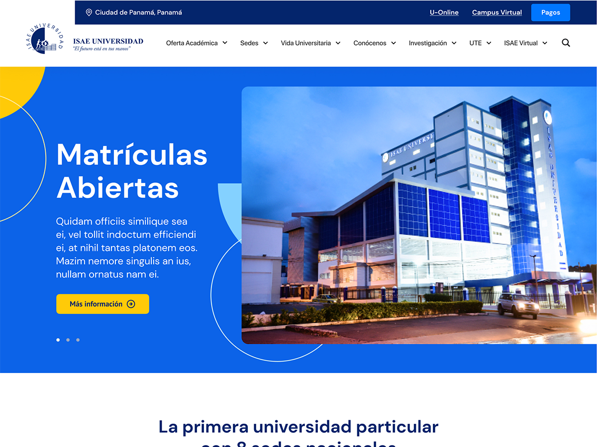

# Tema personalizado ISAE Universidad
## Creado con WordPress y ACF

Este tema es creado usando WordPress y ACF.

Para hacer cambios a este tema es necesario hacer un fork de este repositorio o clonarlo en un ambiente local, recomiendo [Local by Flywheel](https://getflywheel.com/).

Este proyecto debe ser clonado directamente en la carpeta _themes_ dentro de _wp-content_ en un nuevo proyecto de WordPress.

Se debe ejecutar el comando `npm install` para instalar todas las dependencias de desarrollo.

En el archivo package.json se debe cambiar la línea dentro de _scripts_ de browsersync después de la bandera --proxy al dominio del WordPress local (i.e. --proxy 'isaeuniversidad.local').

Para empezar a desarrollar es necesario ejecutar el comando `npm run watch` y abrir el navegador en _localhost:8000_.

